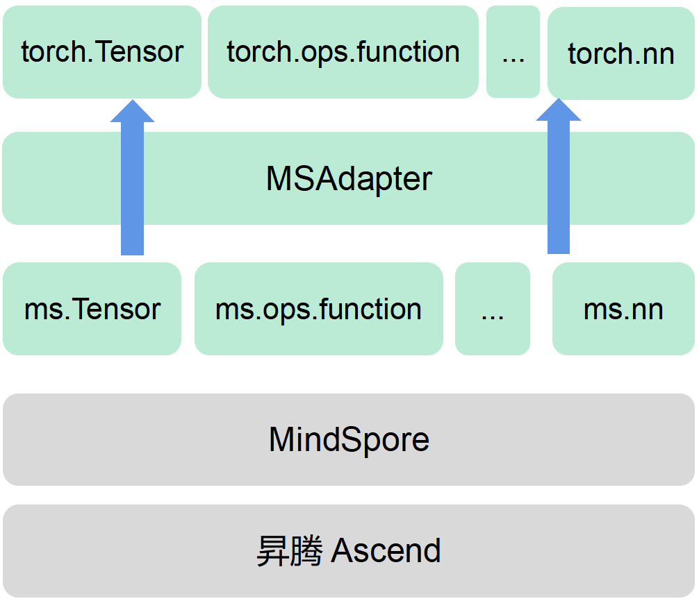
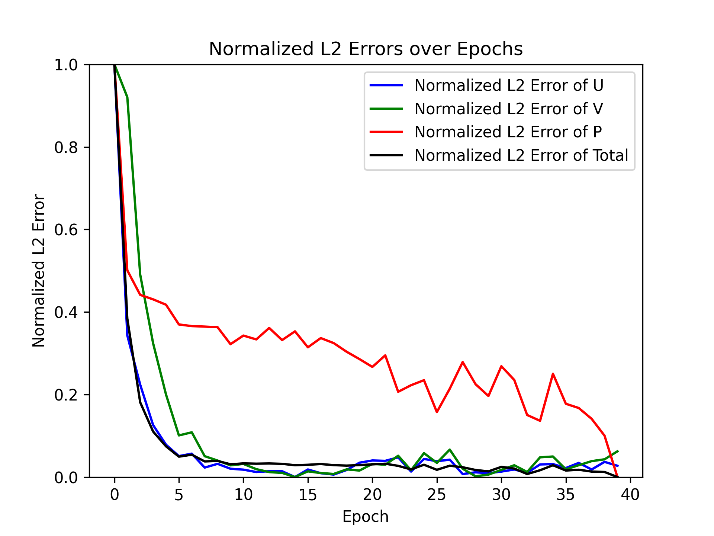
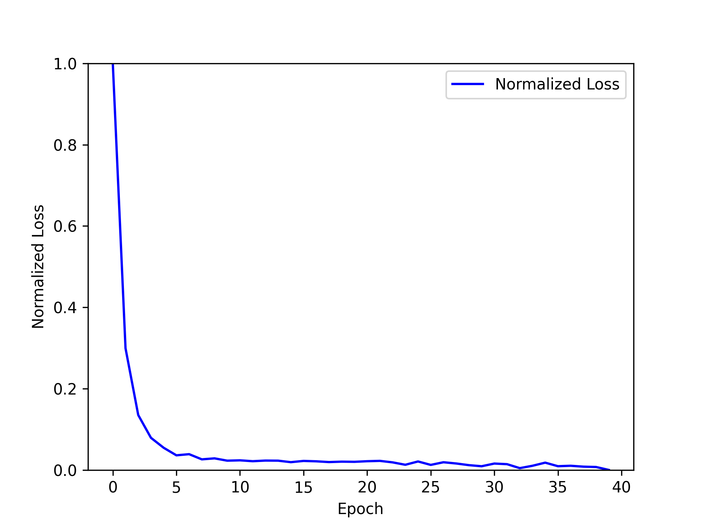

## 1. 论文介绍

### 1.1 背景介绍

物理信息神经网络（PINNs）是一种结合了物理定律和机器学习的新型深度学习方法。这种方法的核心思想是将物理定律（通常以偏微分方程(PDEs) 的形式表示）嵌入到神经网络的损失函数中，从而训练出符合物理规律的模型。PINNs 可以用于解决多种物理问题，包括流体力学、量子力学、反应扩散系统和非线性浅水波的传播等。

### 1.2 论文方法

《Physics-Informed Neural Networks: A Deep Learning Framework for Solving Forward and Inverse Problems Involving Nonlinear Partial Differential Equations》

这篇论文提出了一种名为Physics-Informed Neural Networks（PINNs）的方法，该方法的主要思想是通过自动微分技术，将神经网络的输出与物理定律（如 Navier-Stokes 方程）相结合，形成一个受物理定律约束的神经网络。训练时，网络不仅需要拟合观测数据，还需要满足物理方程的约束条件。这种方法可以有效地利用少量数据进行训练，同时保证结果符合物理规律。

本论文提出的方法（PINNs）具有以下优点：

- PINNs 通过将物理定律嵌入到神经网络中，确保了模型的输出符合物理规律，增强了模型的可解释性和可靠性
- 数据效率：由于引入了物理约束，PINNs 在使用少量训练数据时也能获得较好的性能 。
- 适用广泛：PINNs 可以应用于各种物理问题，包括流体力学、量子力学等 。
- 自动微分：利用自动微分技术，PINNs 可以精确地计算物理约束条件，提升了模型的精度和稳定性 。

### 1.3 数据集介绍
论文中使用的数据集主要是通过数值模拟生成的高分辨率数据集。例如，在研究流体绕圆柱流动问题时，使用了高阶光谱/hp-元素求解器生成的数值模拟数据。这些数据包括流体的速度场和压力场分布，用于训练和验证 PINNs 模型。

### 1.4 Pipeline
- 创建数据集：通过数值模拟生成高分辨率数据集，包含流体的速度场和压力场。

- 构建模型：设计一个深度神经网络，输入为时间和空间坐标，输出为速度场和压力场。

- 自适应损失的多任务学习：定义损失函数，包括数据误差和物理方程误差，通过自适应加权进行多任务学习。

- 优化器：使用基于梯度的优化方法，如 L-BFGS 或 Adam 进行训练。

- Navier-Stokes 2D：将 Navier-Stokes 方程嵌入到神经网络中，作为物理约束条件。

- 模型训练：使用优化器训练模型，使其同时拟合数据和满足物理方程。

- 模型推理及可视化：使用训练好的模型进行推理，并可视化流体的速度场和压力场分布。

## 2. pytorch实现版本

### 2.1 准备工作

创建环境：

```bash
conda create -n mindspore_py37 python=3.7
```

安装依赖包：

```text
# Name                    Version                   Build  Channel
_libgcc_mutex             0.1                        main    defaults
_openmp_mutex             5.1                       1_gnu    defaults
about-time                4.2.1                    pypi_0    pypi
aiohttp                   3.8.6                    pypi_0    pypi
aiosignal                 1.3.1                    pypi_0    pypi
alive-progress            3.1.5                    pypi_0    pypi
asttokens                 2.4.1                    pypi_0    pypi
astunparse                1.6.3                    pypi_0    pypi
async-timeout             4.0.3                    pypi_0    pypi
asynctest                 0.13.0                   pypi_0    pypi
attrs                     23.2.0                   pypi_0    pypi
ca-certificates           2024.3.11            h06a4308_0    defaults
certifi                   2022.12.7        py37h06a4308_0    defaults
charset-normalizer        3.3.2                    pypi_0    pypi
click                     8.1.7                    pypi_0    pypi
cycler                    0.11.0                   pypi_0    pypi
easydict                  1.13                     pypi_0    pypi
exceptiongroup            1.2.1                    pypi_0    pypi
fonttools                 4.38.0                   pypi_0    pypi
frozenlist                1.3.3                    pypi_0    pypi
grapheme                  0.6.0                    pypi_0    pypi
idna                      3.7                      pypi_0    pypi
importlib-metadata        6.7.0                    pypi_0    pypi
iniconfig                 2.0.0                    pypi_0    pypi
joblib                    1.3.2                    pypi_0    pypi
kiwisolver                1.4.5                    pypi_0    pypi
libedit                   3.1.20230828         h5eee18b_0    defaults
libffi                    3.2.1             hf484d3e_1007    defaults
libgcc-ng                 11.2.0               h1234567_1    defaults
libgomp                   11.2.0               h1234567_1    defaults
libstdcxx-ng              11.2.0               h1234567_1    defaults
matplotlib                3.5.3                    pypi_0    pypi
mindflow                  0.3.19                   pypi_0    pypi
mindflow-gpu              0.1.0a0                  pypi_0    pypi
mindspore                 2.2.14                   pypi_0    pypi
mpmath                    1.3.0                    pypi_0    pypi
multidict                 6.0.5                    pypi_0    pypi
ncurses                   6.4                  h6a678d5_0    defaults
numpy                     1.21.6                   pypi_0    pypi
openai                    0.27.0                   pypi_0    pypi
opencv-python             4.10.0.82                pypi_0    pypi
openssl                   1.1.1w               h7f8727e_0    defaults
packaging                 24.0                     pypi_0    pypi
pillow                    9.5.0                    pypi_0    pypi
pip                       22.3.1           py37h06a4308_0    defaults
pluggy                    1.2.0                    pypi_0    pypi
protobuf                  4.24.4                   pypi_0    pypi
psutil                    5.9.8                    pypi_0    pypi
pyparsing                 3.1.2                    pypi_0    pypi
pytest                    7.4.4                    pypi_0    pypi
python                    3.7.5                h0371630_0    defaults
python-dateutil           2.9.0.post0              pypi_0    pypi
pyyaml                    6.0              py37h5eee18b_1    defaults
readline                  7.0                  h7b6447c_5    defaults
requests                  2.31.0                   pypi_0    pypi
scikit-learn              1.0.2                    pypi_0    pypi
scipy                     1.7.3                    pypi_0    pypi
setuptools                65.6.3           py37h06a4308_0    defaults
six                       1.16.0                   pypi_0    pypi
sqlite                    3.33.0               h62c20be_0    defaults
sympy                     1.10.1                   pypi_0    pypi
threadpoolctl             3.1.0                    pypi_0    pypi
tk                        8.6.14               h39e8969_0    defaults
tomli                     2.0.1                    pypi_0    pypi
tqdm                      4.66.4                   pypi_0    pypi
traitlets                 5.9.0                    pypi_0    pypi
typing-extensions         4.7.1                    pypi_0    pypi
urllib3                   2.0.7                    pypi_0    pypi
wheel                     0.38.4           py37h06a4308_0    defaults
xz                        5.4.6                h5eee18b_1    defaults
yaml                      0.2.5                h7b6447c_0    defaults
yarl                      1.9.4                    pypi_0    pypi
zipp                      3.15.0                   pypi_0    pypi
zlib                      1.2.13               h5eee18b_1    defaults
```

数据集下载链接：

https://download.mindspore.cn/mindscience/mindflow/dataset/applications/physics_driven/flow_past_cylinder/dataset/，下载后的数据集放在./dataset文件夹下

该项目的文件目录树如下：

```text
D:.
│  dataload.py
│  losses.npz
│  model.py
│  Normalized_L2_Errors.png
│  train.py
│  utils.py
│
├─.vscode
│      settings.json
│
├─dataset
│      bc_label.npy
│      bc_points.npy
│      eval_label.npy
│      eval_points.npy
│      ic_label.npy
│      ic_points.npy
│
├─videos
│      FlowField_1.png
│      FlowField_10.png
│      FlowField_11.png
│      FlowField_12.png
│      FlowField_13.png
│      FlowField_14.png
│      FlowField_15.png
│      FlowField_16.png
│      FlowField_17.png
│      FlowField_18.png
│      FlowField_19.png
│      FlowField_2.png
│      FlowField_20.png
│      FlowField_21.png
│      FlowField_22.png
│      FlowField_23.png
│      FlowField_24.png
│      FlowField_25.png
│      FlowField_26.png
│      FlowField_27.png
│      FlowField_28.png
│      FlowField_29.png
│      FlowField_3.png
│      FlowField_30.png
│      FlowField_31.png
│      FlowField_32.png
│      FlowField_33.png
│      FlowField_34.png
│      FlowField_35.png
│      FlowField_36.png
│      FlowField_4.png
│      FlowField_5.png
│      FlowField_6.png
│      FlowField_7.png
│      FlowField_8.png
│      FlowField_9.png
│      Normalized_Loss.png
│
└─__pycache__
        dataload.cpython-312.pyc
        model.cpython-312.pyc
        utils.cpython-312.pyc
```

### 2.2 运行代码

执行脚本`train.py`，训练20轮的输出结果如下：

```text
Epoch 1/20, Loss: 0.05707438396434533
Epoch 2/20, Loss: 0.03472208325103311
Epoch 3/20, Loss: 0.032383345319822864
Epoch 4/20, Loss: 0.031525157848472284
Epoch 5/20, Loss: 0.031003626232153112
Epoch 6/20, Loss: 0.03060109546065013
Epoch 7/20, Loss: 0.030438301826811634
Epoch 8/20, Loss: 0.03019165494613905
Epoch 9/20, Loss: 0.030131474761023007
Epoch 10/20, Loss: 0.03008180718211233
Epoch 11/20, Loss: 0.030007300364020842
Epoch 12/20, Loss: 0.029980780670201036
Epoch 13/20, Loss: 0.030187433246732936
Epoch 14/20, Loss: 0.029861006259215114
Epoch 15/20, Loss: 0.029733670210604708
Epoch 16/20, Loss: 0.029759406368708864
Epoch 17/20, Loss: 0.02970433821036981
Epoch 18/20, Loss: 0.02987440633679679
Epoch 19/20, Loss: 0.02965097437801245
Epoch 20/20, Loss: 0.029648902312862366
L2 Error: 1.0292717218399048
```


## 3.MindSpore实现版本

### 3.1 MindSpore框架介绍

MindSpore是华为推出的一款人工智能计算框架，主要用于开发AI应用和模型。它的特点如下:

- 框架设计：MindSpore采用静态计算图设计，PyTorch采用动态计算图设计。静态计算图在模型编译时确定计算过程，动态计算图在运行时确定计算过程。静态计算图通常更高效，动态计算图更灵活；
- 设备支持：MindSpore在云端和边缘端都有较好的支持，可以在Ascend、CPU、GPU等硬件上运行；
- 自动微分：MindSpore提供自动微分功能，可以自动求导数，简化模型训练过程；
- 运算符和层：MindSpore提供丰富的神经网络层和运算符，覆盖CNN、RNN、GAN等多种模型；
- 训练和部署：MindSpore提供方便的模型训练和部署功能，支持ONNX、CANN和MindSpore格式的模型导出，可以部署到Ascend、GPU、CPU等硬件

为了高效率迁移模型及代码，此处使用鹏城实验室和华为联合开发的一款Mindspore生态适配工具——**MSadapter**。该工具能帮助用户高效使用昇腾算力，且在不改变原有PyTorch用户使用习惯的前提下，将代码快速迁移到Mindspore生态上。

MSAdapter的API完全参照PyTorch设计，用户仅需少量修改就能轻松地将PyTorch代码高效运行在昇腾上。目前MSAdapter已经适配**torch、torch.nn**等800+接口。



### 3.2 环境安装

首先在本地启用WSL（Windows Subsystem for Linux）功能，安装Ubuntu，并安装MindSpore框架，使用2.0.0版本，以便搭配msadapter来进行便捷的模型迁移

- 通过pip安装MindSpore并验证：

```bash
pip install mindspore==2.0.0	#安装MindSpore

#验证是否成功安装
python -c "import mindspore;mindspore.run_check()"

#如果输出以下内容则安装成功
MindSpore version:  2.0.0
The result of multiplication calculation is correct, MindSpore has been installed on platform [CPU] successfully!
```

- 安装msadapter

```bash
#该命令只能应用于版本为2.0.0的MindSpore框架
pip install msadapter
```

安装完成之后便可以直接进行模型迁移

### 3.3 模型迁移

- 替换导入模块（修改头文件）

```python
# import torch
# from torch.utils.data import Dataset
# from torch import nn
# from torch.utils.data import DataLoader

from msadapter.pytorch.utils.data import Dataset
import msadapter.pytorch as torch
import msadapter.pytorch.optim as optim
import mindspore
from mindspore import Tensor, context, ops, nn
```

- 替换网络训练脚本

```python
# pytorch 写法
# optimizer = torch.optim.SGD(net.parameters(), lr=0.01, momentum=0.9)
# MindSpore 写法
optimizer = optim.SGD(model.trainable_params(), learning_rate=0.01, momentum=0.9)
```

更多迁移细节可参考：https://openi.pcl.ac.cn/OpenI/MSAdapter

### 3.4 详细迁移代码

#### 数据集实现

```python
import os
import numpy as np
# import torch
# from torch.utils.data import Dataset
from msadapter.pytorch.utils.data import Dataset
import msadapter.pytorch as torch

class FlowDataset(Dataset):
    def __init__(self, data_dir, bc_points_file, bc_labels_file, ic_points_file, ic_labels_file):
        self.bc_points = np.load(os.path.join(data_dir, bc_points_file))
        self.bc_labels = np.load(os.path.join(data_dir, bc_labels_file))
        self.ic_points = np.load(os.path.join(data_dir, ic_points_file))
        self.ic_labels = np.load(os.path.join(data_dir, ic_labels_file))

        self.bc_len = len(self.bc_points)
        self.ic_len = len(self.ic_points)

    def __len__(self):
        return max(self.bc_len, self.ic_len)

    def __getitem__(self, idx):
        bc_idx = idx % self.bc_len
        ic_idx = idx % self.ic_len

        # 合并边界条件和初始条件
        points = np.concatenate((self.bc_points[bc_idx], self.ic_points[ic_idx]), axis=0)
        labels = np.concatenate((self.bc_labels[bc_idx], self.ic_labels[ic_idx]), axis=0)

        # 确保点的数量是 3
        points = points[:3]
        labels = labels[:3]

        return torch.tensor(points, dtype=torch.float32), torch.tensor(labels, dtype=torch.float32)

def create_datasets(data_dir):
    train_dataset = FlowDataset(
        data_dir,
        bc_points_file="bc_points.npy",
        bc_labels_file="bc_label.npy",
        ic_points_file="ic_points.npy",
        ic_labels_file="ic_label.npy"
    )
    return train_dataset

def create_test_dataset(data_dir):
    inputs = np.load(os.path.join(data_dir, 'eval_points.npy'))
    labels = np.load(os.path.join(data_dir, 'eval_label.npy'))
    return inputs, labels
```

#### 训练过程

```python
import numpy as np
# from torch import nn
# from torch.utils.data import DataLoader
import msadapter.pytorch.nn as nn
import msadapter.pytorch.optim as optim
from msadapter.pytorch.utils.data import DataLoader
from model import DeepModel
from dataload import create_datasets, create_test_dataset
from utils import train, evaluate, visualize
import matplotlib.pyplot as plt

# 设置设备
device = "cuda"

# 配置文件
config = {
    "data_dir": "./dataset",
    "bc_points_file": "bc_points.npy",
    "bc_labels_file": "bc_label.npy",
    "ic_points_file": "ic_points.npy",
    "ic_labels_file": "ic_label.npy"
}

# 创建数据集和数据加载器
train_dataset = create_datasets(config["data_dir"])
train_loader = DataLoader(train_dataset, batch_size=32, shuffle=True)

# 实例化模型
model = DeepModel().to(device)
# 定义损失函数和优化器
criterion = nn.MSELoss()
# optimizer = nn.optim.Adam(model.parameters(), lr=0.001)
optimizer = optim.SGD(model.trainable_params(), learning_rate=0.01, momentum=0.9)
# 训练模型
loss_file = "losses.npz"
losses, l2_error_u, l2_error_v, l2_error_p, l2_error_total = train(model, 
        train_loader, criterion, optimizer, epochs=10, device=device, loss_file=loss_file)
# 测试数据
test_inputs, test_labels = create_test_dataset(config["data_dir"])

# 评估模型
evaluate(model, test_inputs)

# 可视化结果
# 加载 loss 值
data = np.load("losses.npz")
losses = data['loss']
l2_error_u = data['l2_error_u']
l2_error_v = data['l2_error_v']
l2_error_p = data['l2_error_p']
l2_error_total = data['l2_error_total']

# 绘制误差曲线
plt.figure(dpi=300)

epochs = np.arange(len(l2_error_u))

plt.plot(epochs, l2_error_u, 'b-', label="Normalized L2 Error of U")
plt.plot(epochs, l2_error_v, 'g-', label="Normalized L2 Error of V")
plt.plot(epochs, l2_error_p, 'r-', label="Normalized L2 Error of P")
plt.plot(epochs, l2_error_total, 'k-', label="Normalized L2 Error of Total")

plt.legend()
plt.xlabel('Epoch')
plt.ylabel('Normalized L2 Error')
plt.ylim(0, 1)
plt.title('Normalized L2 Errors over Epochs')
plt.savefig("Normalized_L2_Errors.png")

visualize(model, test_inputs, test_labels, losses, path="./videos", dpi=300)
```

#### 3.5 运行结果

代码执行完毕后，会在`./video`目录下生成图片流，如下所示：


所生成的误差曲线图，在对其进行归一化之后如下所示：



损失曲线如下：



根据误差曲线图，可以得知该模型的性能在训练过程中是逐步提升的
